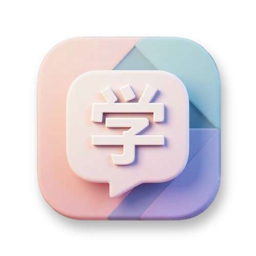

# Manabu 学ぶ
Learn Japanese words every time you open a new tab in your browser.  
(_Currently only Chrome is supported._)  


## Features
- Browser extension that changes the new tab page.
- Displays a random Japanese word with furigana and English translation on every new tab.
- Dark/light mode toggle with persistent settings.
- ~~Bookmark favorite words for later review.~~
- Filter words by category (noun, verb, adjective, etc.).
- Filter words by [JLPT](https://www.jlpt.jp/e/) level (N1 to N5).
- Read out Japanese words by using the [Web Speech API](https://developer.mozilla.org/en-US/docs/Web/API/Web_Speech_API).
- Built with TypeScript and Web Components.

## Installation
1. Clone or download this repository
2. Install dependencies:
   ```bash
   npm install
   ```
3. Build the extension:
   ```bash
   npm run build
   ```
4. Open Chrome and navigate to `chrome://extensions`
5. Enable "Developer mode" in the top right corner
6. Click "Load unpacked" and select the extension directory

## Development
To start development with watch mode:
```bash
npm run dev
```

This will watch for changes in the src/ folder, rebuild automatically and reload the browser.

Based on [言葉 の Tab](https://addons.mozilla.org/en-US/firefox/addon/the-tab-of-words/) and [Tab of Words](https://tab-of-words.keibungen.com/).


## License
This project is licensed under the MIT License - see the [LICENSE](LICENSE) file for details.
